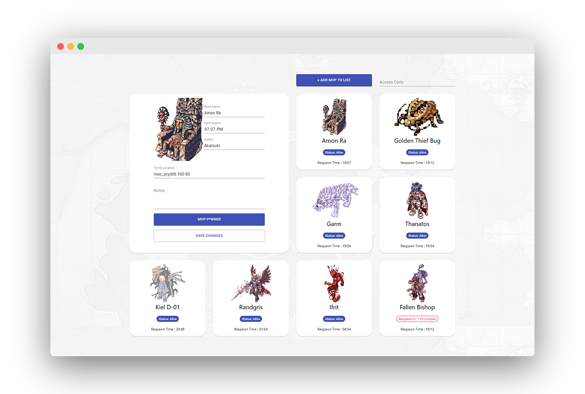

<!-- PROJECT LOGO -->
<p align="center">
  
    <h3 align="center">RO MVP Tracker Webapp</h3>

  <p align="center">
    An MVP tracker that can be used to time boss monsters respawn written in ReactJS and Flask
    <br />
    <a href="#"><strong>Explore the docs »</strong></a>
    <br />
    <br />
    <a href="https://kristianespina.github.io/RO-MVP-Timer/">View Demo</a>
    ·
    <a href="https://github.com/kristianespina/RO-MVP-Timerissues">Report Bug</a>
    ·
    <a href="https://github.com/kristianespina/RO-MVP-Timerissues">Request Feature</a>
  </p>
</p>

## Screenshots

Well, what good is a wall of text when we can just show screenshots, right?



<!-- GETTING STARTED -->
## Getting Started

### Install the pre-requisites

```bash
# for the back-end
cd api
pip install -r requirements.txt
```

```bash
# for the front-end
cd frontend
npm install
```

## Usage

### To run the backend server (Flask)

```bash
# in root directory
cd api && python app.py
```

### To run the frontend server (ReactJS)

```bash
# in root directory
# Serve the webserver
cd frontend && npm start

# Or build the app
cd frontend && npm run build
```

<!-- CONTRIBUTING -->
## Contributing

Contributions are what make the open source community such an amazing place to be learn, inspire, and create. Any contributions you make are **greatly appreciated**.

1. Fork the Project
2. Create your Feature Branch (`git checkout -b feature/AmazingFeature`)
3. Commit your Changes (`git commit -m 'Add some AmazingFeature'`)
4. Push to the Branch (`git push origin feature/AmazingFeature`)
5. Open a Pull Request

<!-- ACKNOWLEDGEMENTS -->
## Acknowledgements

* [README template](https://github.com/othneildrew/Best-README-Template/blob/master/README.md)